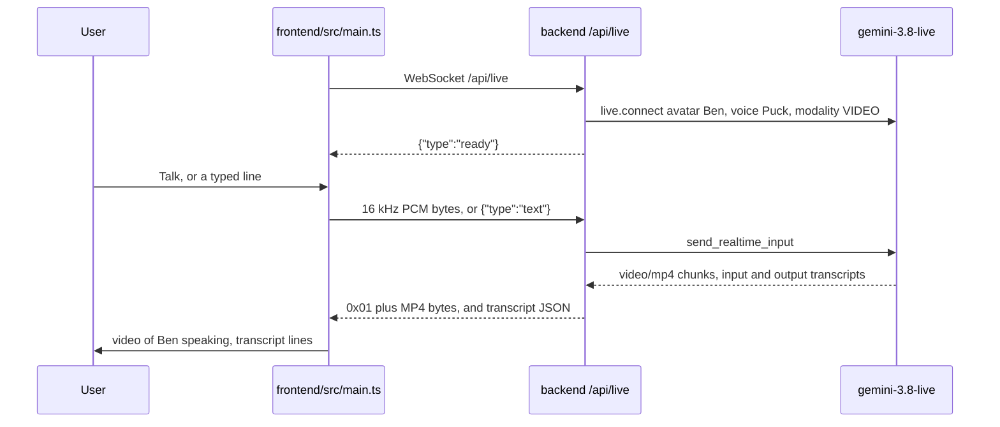

# Avatar speech-to-speech

The chat UI talks to **Gemini 3.8 Live** (`gemini-3.8-live`). The model hears the user, answers out loud, and streams a talking face in the same video. The default face is the preset avatar **Ben**. The default voice is **Puck**.

The spoken session does not query a Vertex AI Search datastore. The underwriting stores (`uw-accounts`, `uw-guidelines`, `uw-exposures`) and the `uw-search` engine were removed from project `gcpexplore-487204`. Ben answers from the live model itself. The older book-retrieval path is described in `context_graph.md` and is not connected to this WebSocket.

## What runs where

```
Browser  frontend/  (Vite, http://127.0.0.1:5173)
  |  microphone  ->  16 kHz PCM over WebSocket /api/live
  |  typed text  ->  JSON { type: "text" }
  |  video/mp4   <-  binary frames, played in <video>
  v
FastAPI  backend/main.py  (http://127.0.0.1:8080)
  |  Google Gen AI SDK live.connect
  v
Gemini Enterprise Agent Platform
  model gemini-3.8-live
  project gcpexplore-487204
  location us-central1
```

Vite proxies `/api`, including the WebSocket, to the API (`frontend/vite.config.ts`).

| Piece | File |
|---|---|
| Page, mic, transcript, video player | `frontend/src/main.ts` |
| Layout | `frontend/src/style.css` |
| Downsample mic audio to 16 kHz PCM | `frontend/public/pcm-worklet.js` |
| Live session proxy | `backend/main.py` function `live` |
| SDK | `google-genai` in `backend/requirements.txt` |

Start the API, then the page:

```bash
.venv/bin/uvicorn main:app --app-dir backend --host 127.0.0.1 --port 8080
cd frontend && npm run dev
```

The browser opens http://127.0.0.1:5173. The API uses Application Default Credentials for project `gcpexplore-487204`.

## Default avatar

The default face has a name: **Ben**. The voice paired with that face is **Puck**.

Google ships Ben as a preset. The app does not upload a photo or a `.glb` for him. `_live_config()` in `backend/main.py` asks `gemini-3.8-live` for video and passes the preset name:

```python
def _live_config() -> types.LiveConnectConfig:
    return types.LiveConnectConfig(
        response_modalities=["VIDEO"],
        speech_config=types.SpeechConfig(
            voice_config=types.VoiceConfig(
                prebuilt_voice_config=types.PrebuiltVoiceConfig(voice_name="Puck")
            )
        ),
        avatar_config=types.AvatarConfig(avatar_name="Ben"),
        # transcription and system instruction follow
    )
```

| Setting | Value | What it does |
|---|---|---|
| Model | `gemini-3.8-live` | Live speech-to-speech model |
| `response_modalities` | `VIDEO` | Turns on Live Avatar and returns the talking face |
| `avatar_name` | `Ben` | Which preset face the model draws |
| `voice_name` | `Puck` | Which preset voice speaks with that face |

`VIDEO` makes the model draw the face. `avatar_name="Ben"` chooses which face. The model returns one `video/mp4` stream. Speech is inside that stream (AAC), lip-synced to Ben at 24 FPS. The page does not play a separate audio track.

A different face is a still portrait passed as `avatar_config.customized_avatar`, not a `.glb` model. Project `gcpexplore-487204` is not allowlisted for that feature, so the session stays on Ben. A prepared portrait, if present, is `backend/avatar.png` and is gitignored.

## Speech-to-speech path



1. The page opens `ws://<host>/api/live` as soon as it loads (`connect()` in `frontend/src/main.ts`).
2. The API accepts the socket and opens one Live session with `_live_config()`. When setup finishes it sends `{ "type": "ready", "avatar": "Ben", "voice": "Puck" }`.
3. **Talk** calls `getUserMedia` with echo cancellation. `pcm-worklet.js` downsamples the mic to 16 kHz and posts 100 ms chunks of 16-bit little-endian mono PCM. The page sends those bytes on the WebSocket. **Stop** sends `{ "type": "audio_end" }`, which the API forwards as `audio_stream_end`.
4. A typed line is `{ "type": "text", "text": "..." }`. The API calls `send_realtime_input(text=...)`.
5. Gemini Live runs voice activity detection on the PCM. It transcribes the user, generates the reply, and synthesizes Ben’s face and Puck’s voice together.
6. The API reads `session.receive()` in a loop. The SDK iterator stops at `turn_complete`, so the loop calls `receive()` again and the same Live session stays up for the next question.
7. For each server message the API forwards:
   - `input_transcription` as `{ "type": "transcript", "role": "user", "text" }`
   - `output_transcription` as `{ "type": "transcript", "role": "model", "text" }`
   - each `video/mp4` inline blob as a binary frame whose first byte is `0x01` and whose remaining bytes are the MP4 chunk
   - `{ "type": "turn_complete" }` when the spoken turn ends
8. `AvatarPlayer` appends those chunks to a Media Source buffer (`video/mp4; codecs="avc1.42C01F, mp4a.40.2"`, mode `sequence`). The first chunk is an init segment (`ftyp` / `dash`). Later chunks are media segments. The `<video>` element plays picture and speech together.

If the socket closes, the page waits 800 ms and calls `connect()` again. That opens a new Live session. It does not resume the previous one.

## Continuous speech

Continuous speech means the person can keep talking, pause, and talk over Ben without pressing Talk again, and Ben’s voice does not restart on every sentence.

What already works:

- One Live session stays open. `model_to_browser` calls `session.receive()` again after each `turn_complete`.
- While **Talk** is on, the worklet sends PCM continuously, about 100 ms at a time. The client does not wait for a full sentence.
- Automatic activity detection is left on. The server, not the page, decides when the person has stopped speaking and Ben should answer.
- The default activity handling is `START_OF_ACTIVITY_INTERRUPTS`, so speech that arrives while Ben is talking can cut him off.

What still has to be done:

1. **Leave the microphone open.** Today **Stop** sends `{ "type": "audio_end" }`, and the API forwards `audio_stream_end`. That ends the audio stream. The next utterance needs **Talk** again. For a continuous conversation, send `audio_stream_end` only when the person leaves. Do not send it between turns.
2. **Keep server-side voice detection.** Do not set `automatic_activity_detection.disabled`. Tune `silence_duration_ms` on `RealtimeInputConfig` so a breath does not end the turn, and `prefix_padding_ms` so a short phrase still counts as speech. A larger silence window waits longer before Ben replies.
3. **Keep the mic open while Ben speaks.** Barge-in only works if PCM is still flowing. Echo cancellation is already requested on `getUserMedia`. Headphones are the reliable way to stop Ben’s speaker audio from coming back in as a new user turn.
4. **Append video instead of restarting it.** `AvatarPlayer` calls `reset()` when a chunk begins with `ftyp`. That tears down the `<video>` element and clips the previous sentence. Append later media segments to the same SourceBuffer. Reset only when a new init segment cannot be appended.
5. **Reconnect only when the socket dies.** `turn_complete` must not close the WebSocket. A reconnect calls `connect()` and opens a blank Live session, so Ben no longer has the earlier turns. Resume with the server’s session handle if the socket has to come back.
6. **Use the mic alone while it is open.** A typed line on the same socket (`send_realtime_input(text=...)`) can split the live turn. During continuous speech, keep text input off until **Stop**.

## Where the answer comes from

Ben’s reply is the model’s own generation for that turn. `_live_config()` does not attach `search_knowledge`, `expand_graph`, Vertex AI Search, or the session context graph. The system instruction only asks for a short spoken answer:

> You are a concise spoken assistant. Answer in a sentence or two. The person can see your face, so do not describe yourself.

`POST /api/chat` is still in `backend/main.py`. That route streams a query to a reasoning engine when `REASONING_ENGINE` is set. The avatar page never calls it. With the engine removed, that route cannot retrieve book passages either.

To have Ben answer from the underwriting book, the Live session would need a tool that searches a datastore and returns passages into the same turn. That tool is not implemented on `/api/live`.

## Audio and video formats

| Direction | Format |
|---|---|
| Mic into the model | 16 kHz, 16-bit, mono PCM (`audio/pcm;rate=16000`) |
| Model back to the page | Fragmented MP4 (`video/mp4`), H.264 `avc1.42C01F` plus AAC `mp4a.40.2` |
| Transcripts | Incremental text fragments, concatenated into the You and Ben lines |

The page copies each MP4 chunk before `appendBuffer`, because the buffer the socket delivered is detached by the player.
