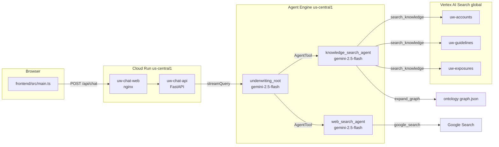
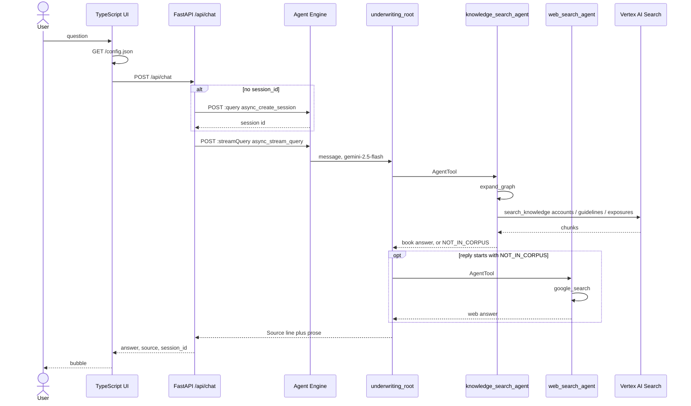
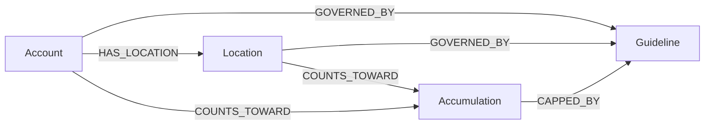
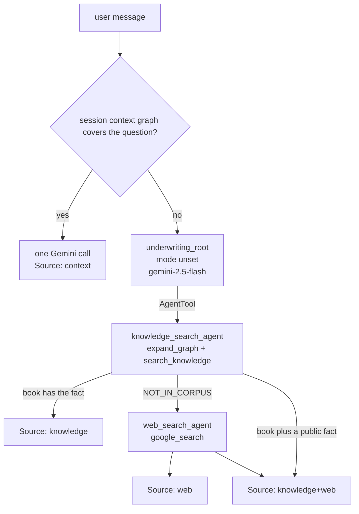
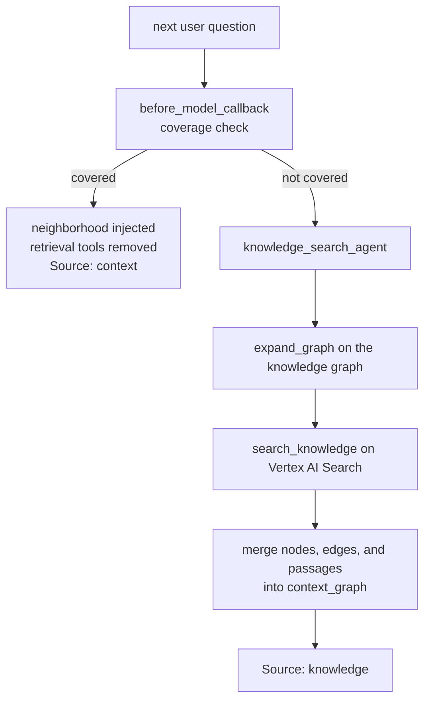

# llm_wiki

Fictional commercial-property underwriting desk. A typed ontology joins three Vertex AI Search datastores. An ADK 2.8 root agent asks a knowledge agent first and a web agent only when the book does not contain the fact. FastAPI and a TypeScript UI on Cloud Run call that agent on Agent Engine.

**All underwriting figures are fictional.** Named companies are example applicants only.

Live chat: https://uw-chat-web-1097847958671.us-central1.run.app

API: https://uw-chat-api-1097847958671.us-central1.run.app

## What runs where

```
Browser  (frontend/, Vite + TypeScript)
  |  GET  /config.json          nginx writes this at container start
  |  POST /api/chat             { message, session_id, user_id }
  v
Cloud Run  uw-chat-web          nginx :8080, us-central1
  |
  v
Cloud Run  uw-chat-api          FastAPI, us-central1
  |  GET  /api/health
  |  POST /api/chat
  |       first turn:  POST .../reasoningEngines/3732256486357729280:query
  |                     class_method async_create_session
  |       every turn:  POST .../reasoningEngines/3732256486357729280:streamQuery
  |                     class_method async_stream_query
  v
Agent Engine  ADK 2.8.0         gemini-2.5-flash, us-central1
  underwriting_root
     |-- consult_context_graph -> session context_graph (fast path)
     |-- AgentTool --> knowledge_search_agent
     |                    expand_graph --------> ontology in uw_chat/graph.json
     |                    search_knowledge ----> Vertex AI Search (global)
     |                         uw-accounts      4 Account docs
     |                         uw-guidelines   11 Guideline docs
     |                         uw-exposures    13 Location + Accumulation docs
     |                    both tools merge the neighborhood into context_graph
     |-- AgentTool --> web_search_agent
                          google_search ------> public web
```



## Sequence

The browser keeps `session_id` after the first reply. Later turns skip session create and only call `streamQuery`.



## Knowledge graph RAG

The book is the OKF markdown in `okf/`. `scripts/provision_search.py` types each page and writes `uw_chat/graph.json` (28 nodes, 52 edges). Snapshots in `okf/syntheses/` are left out so the join is rebuilt at question time. The ontology write-up is `ontology/underwriting.md`.

| Type | Datastore | Id pattern | Count |
|---|---|---|---|
| Account | `uw-accounts` | `companies/*` | 4 |
| Guideline | `uw-guidelines` | `ike/*` | 11 |
| Location | `uw-exposures` | `exposure/*` except `accum*` | 11 |
| Accumulation | `uw-exposures` | `exposure/accum*` | 2 |



`expand_graph` links names in the question to those nodes, then walks two forward hops. A named location does not pull sibling sites. A named accumulation walks back along `COUNTS_TOWARD` so both plants that feed Puerto Rico stay in the neighborhood. `search_knowledge` then queries the datastore that owns each node (`CHUNKS` on `servingConfigs/default_config`). Search passages win when they contain the fact. Excerpts from `graph.json` fill a relation the chunk did not repeat.

Documents live in `gs://gcpexplore-487204-uw-corpus`. The three stores and the `uw-search` engine are in Discovery Engine location `global`, collection `default_collection`, project `gcpexplore-487204`.

## ADK agent graph

Package `uw_chat/`, ADK `google-adk[a2a]==2.8.0`. Every agent uses model `gemini-2.5-flash` (`MODEL` in `uw_chat/agent.py`). `mode` is unset. The root does not use `google.adk.workflow.Workflow` edges. The knowledge and web agents are `AgentTool`s. On a new entity the root calls the knowledge agent, then the web agent only when the reply starts with `NOT_IN_CORPUS`. A follow-up already in the session context graph skips both tools.



| Agent | Name | Tools |
|---|---|---|
| Root | `underwriting_root` | `consult_context_graph`, `AgentTool(knowledge_search_agent)`, `AgentTool(web_search_agent)` |
| Knowledge | `knowledge_search_agent` | `expand_graph`, `search_knowledge` |
| Web | `web_search_agent` | `google_search` |

Each `AgentTool` call opens a fresh in-memory session that holds only that request. State written by `expand_graph` and `search_knowledge` is copied back onto the root session. The multi-turn transcript the UI shows is that root session, kept by `session_id`.

## Context graph

The knowledge graph (`uw_chat/graph.json` plus the three datastores) is the retrieval index. The context graph is the neighborhood already retrieved in this chat, stored on the Agent Engine session under `context_graph`.



A follow-up that names the same account or location, or that names no new entity, is covered. Before the model runs, that neighborhood is written into the prompt and the retrieval tools are removed, so the turn is a single Gemini call. A question that names a new account or site is not covered: retrieval runs, then the new nodes are merged in. The stored graph is capped at 20 nodes. `consult_context_graph` remains available on retrieval turns.

## Agent Engine

| | |
|---|---|
| Project | `gcpexplore-487204` |
| Region | `us-central1` |
| Display name | Underwriting desk |
| Resource | `projects/gcpexplore-487204/locations/us-central1/reasoningEngines/3732256486357729280` |
| ADK | 2.8.0 |
| Model | `gemini-2.5-flash` |
| Runtime identity | `service-1097847958671@gcp-sa-aiplatform-re.iam.gserviceaccount.com` (`roles/discoveryengine.viewer`) |

Playground: https://console.cloud.google.com/vertex-ai/agents/agent-engines/locations/us-central1/agent-engines/3732256486357729280/playground?project=gcpexplore-487204

Deploy from the repo root, with `google-cloud-aiplatform` installed so the CLI can import `vertexai`:

```bash
.venv/bin/pip install 'google-adk[a2a]==2.8.0' 'google-cloud-aiplatform[adk,agent_engines]'
.venv/bin/adk deploy agent_engine \
  --project=gcpexplore-487204 \
  --region=us-central1 \
  --display_name="Underwriting desk" \
  --agent_engine_id=3732256486357729280 \
  --temp_folder=/tmp/uw-adk-deploy \
  uw_chat
```

Omit `--agent_engine_id` to create a new engine. The requirements ADK deploys are `uw_chat/requirements.txt`.

Create the stores and the ontology file first:

```bash
.venv/bin/python scripts/provision_search.py
```

## Cloud Run

Both services are `us-central1`, port 8080, unauthenticated. The API service account is the default compute account, with `roles/aiplatform.user` so it can call Agent Engine.

| Service | Image | URL |
|---|---|---|
| `uw-chat-api` | `backend/Dockerfile` (Python 3.12, uvicorn) | https://uw-chat-api-1097847958671.us-central1.run.app |
| `uw-chat-web` | `frontend/Dockerfile` (Vite build, nginx) | https://uw-chat-web-1097847958671.us-central1.run.app |

```bash
gcloud run deploy uw-chat-api \
  --source backend \
  --region us-central1 \
  --project gcpexplore-487204 \
  --allow-unauthenticated \
  --port 8080 \
  --memory 512Mi \
  --timeout 300 \
  --set-env-vars GOOGLE_CLOUD_PROJECT=gcpexplore-487204,GOOGLE_CLOUD_LOCATION=us-central1,REASONING_ENGINE=projects/gcpexplore-487204/locations/us-central1/reasoningEngines/3732256486357729280

gcloud run deploy uw-chat-web \
  --source frontend \
  --region us-central1 \
  --project gcpexplore-487204 \
  --allow-unauthenticated \
  --port 8080 \
  --memory 256Mi \
  --set-env-vars API_BASE=https://uw-chat-api-1097847958671.us-central1.run.app
```

`frontend/docker-entrypoint.sh` writes `/config.json` from `API_BASE` before nginx starts.

## FastAPI

`backend/main.py` exposes two routes. CORS allows any origin.

`GET /api/health`

```json
{"ok": true, "engine_configured": true}
```

`POST /api/chat`

Request:

```json
{"message": "Can we write Texwin Acquisitions for the Houston warehouse?", "session_id": null, "user_id": "desk"}
```

Response:

```json
{"session_id": "5567119051248893952", "answer": "...", "source": "knowledge", "agents": ["underwriting_root", "knowledge_search_agent"]}
```

`source` is `knowledge`, `web`, or `mixed`, taken from the root's first line (`Source: knowledge`, `Source: web`, or `Source: knowledge+web`).

Inside `chat`, the API calls Vertex with the Cloud Run service account:

| When | HTTP | Body |
|---|---|---|
| `session_id` is empty | `POST https://us-central1-aiplatform.googleapis.com/v1/{engine}:query` | `{"class_method":"async_create_session","input":{"user_id":"..."}}` |
| every message | `POST https://us-central1-aiplatform.googleapis.com/v1/{engine}:streamQuery` | `{"class_method":"async_stream_query","input":{"user_id","session_id","message"}}` |

`{engine}` is `projects/gcpexplore-487204/locations/us-central1/reasoningEngines/3732256486357729280`.

## TypeScript frontend

`frontend/` is Vite 6 and TypeScript 5.6. There is no React. `frontend/src/main.ts` builds the page, and `frontend/src/style.css` styles it.

On load it reads `localStorage` key `uw-user` (a `crypto.randomUUID()` if missing). Each send does:

1. `GET /config.json` and reads `apiBase`.
2. `POST {apiBase}/api/chat` with `message`, `session_id`, and `user_id`.
3. Stores `session_id` from the response for the next turn.

Suggested prompts in the page include the Houston warehouse question and "What is the weather in Houston right now?" so the web fallback has a case the book cannot answer.

```bash
cd frontend && npm install && npm run build
```

## Local wiki and Neo4j

The same OKF bundle still drives the local LLM-wiki graph and the Neo4j example. Those paths do not call Agent Engine.

```
okf/                  # OKF bundle (markdown concepts + links)
graph/                # LLM-wiki knowledge graph (SVG + interactive HTML)
graph_rag/            # Neo4j Graph RAG example
adk_underwriting/     # local ADK router + company / IKE / exposure specialists
uw_chat/              # ADK 2.8 desk deployed to Agent Engine
backend/              # FastAPI
frontend/             # TypeScript UI
ontology/             # underwriting ontology
```

Wiki pages are nodes. Markdown links are edges. Color is page type.


```bash
python3 scripts/build_graph.py   # regenerates graph/ from okf/
pip install -r requirements.txt
adk web adk_underwriting
```

Side-by-side with Neo4j: [graph_rag/README.md](graph_rag/README.md).

```bash
./scripts/start_neo4j.sh
python3 -m graph_rag.load
python3 -m graph_rag "Can we write Texwin Acquisitions for the Houston warehouse?"
```


## Layout

```
okf/                  # OKF bundle (markdown concepts + links)
  companies/          # Axium Foods, Baxter International, Goya Foods, Texwin Acquisitions
  ike/                # Mock IKE guideline articles
  exposure/           # Mock TIV / CAT / flood / accumulation docs
  syntheses/          # Compiled UW snapshots
graph/                # LLM-wiki knowledge graph (SVG + interactive HTML)
graph_rag/            # Neo4j Graph RAG example (typed nodes + query-time expansion)
adk_underwriting/     # ADK router + three sub-agents
```

## Knowledge graph

Wiki pages are **nodes**. Markdown links are **edges**. Color is page type; size is how many links the page has — the same encoding as an LLM-wiki Graph view (not a flowchart).


Blue = accounts, purple = IKE guidelines, orange = exposure. Shared nodes (food processing, warehouse, coastal wind, Puerto Rico CAT) sit between books.

Interactive viewer (force layout, hover neighbors, click a node, search):

```bash
python3 scripts/build_graph.py   # regenerates graph/ from okf/
open graph/graph.html
```

## Run the agent

```bash
pip install -r requirements.txt
adk web adk_underwriting
```

Example questions:

- Can we write Texwin Acquisitions LLC for the Houston warehouse?
- If we bind Baxter and Goya, do we breach the Puerto Rico cap?
- What IKE articles fire for Axium Foods Inc?

The router calls `okf_resolve_company` first, then invokes `company_agent`, `ike_agent`, and `exposure_agent` with only the linked document ids.

On GCP, replace the mock datastore tools in `adk_underwriting/tools.py` with `VertexAiSearchTool` pointed at your three Vertex AI Search datastores. Keep the OKF resolve step as the graph layer.

## LLM wiki vs Graph RAG

Side-by-side on the same Texwin / Houston question: [graph_rag/README.md](graph_rag/README.md).

```bash
pip install -r requirements.txt
chmod +x scripts/start_neo4j.sh
./scripts/start_neo4j.sh
python3 -m graph_rag.load
python3 -m graph_rag "Can we write Texwin Acquisitions for the Houston warehouse?"
```
