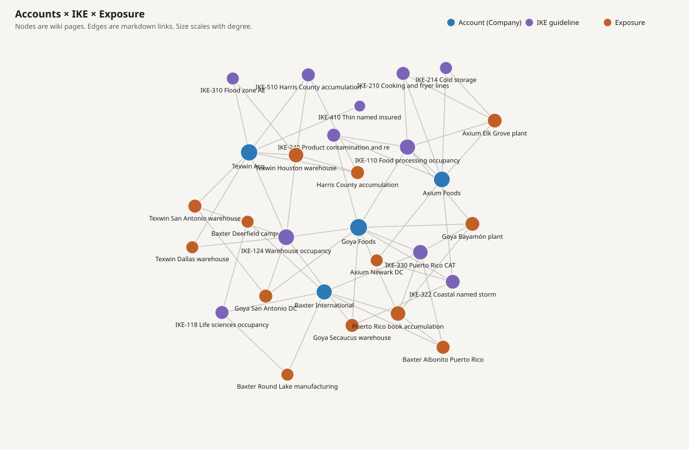

# llm_wiki

Mock LLM-wiki / [Open Knowledge Format](https://github.com/GoogleCloudPlatform/open-knowledge-format) bundle plus a Google ADK router that walks the graph, then calls Company, IKE, and Exposure specialists.

**All underwriting figures are fictional.** Named companies are used only as example applicants.

## Layout

```
okf/                  # OKF bundle (markdown concepts + links)
  companies/          # Axium Foods, Baxter International, Goya Foods, Texwin Acquisitions
  ike/                # Mock IKE guideline articles
  exposure/           # Mock TIV / CAT / flood / accumulation docs
  syntheses/          # Compiled UW snapshots
graph/                # LLM-wiki knowledge graph (SVG + interactive HTML)
adk_underwriting/     # ADK router + three sub-agents
```

## Knowledge graph

Wiki pages are **nodes**. Markdown links are **edges**. Color is page type; size is how many links the page has — the same encoding as an LLM-wiki Graph view (not a flowchart).



Blue = accounts, purple = IKE guidelines, orange = exposure. Shared nodes (food processing, warehouse, coastal wind, Puerto Rico CAT) sit between books.

Interactive viewer (force layout, hover neighbors, click a node, search):

```bash
python3 scripts/build_graph.py   # regenerates graph/ from okf/
open graph/graph.html
```

## Run the agent

```bash
pip install -r requirements.txt
adk web adk_underwriting
```

Example questions:

- Can we write Texwin Acquisitions LLC for the Houston warehouse?
- If we bind Baxter and Goya, do we breach the Puerto Rico cap?
- What IKE articles fire for Axium Foods Inc?

The router calls `okf_resolve_company` first, then invokes `company_agent`, `ike_agent`, and `exposure_agent` with only the linked document ids.

On GCP, replace the mock datastore tools in `adk_underwriting/tools.py` with `VertexAiSearchTool` pointed at your three Vertex AI Search datastores. Keep the OKF resolve step as the graph layer.
