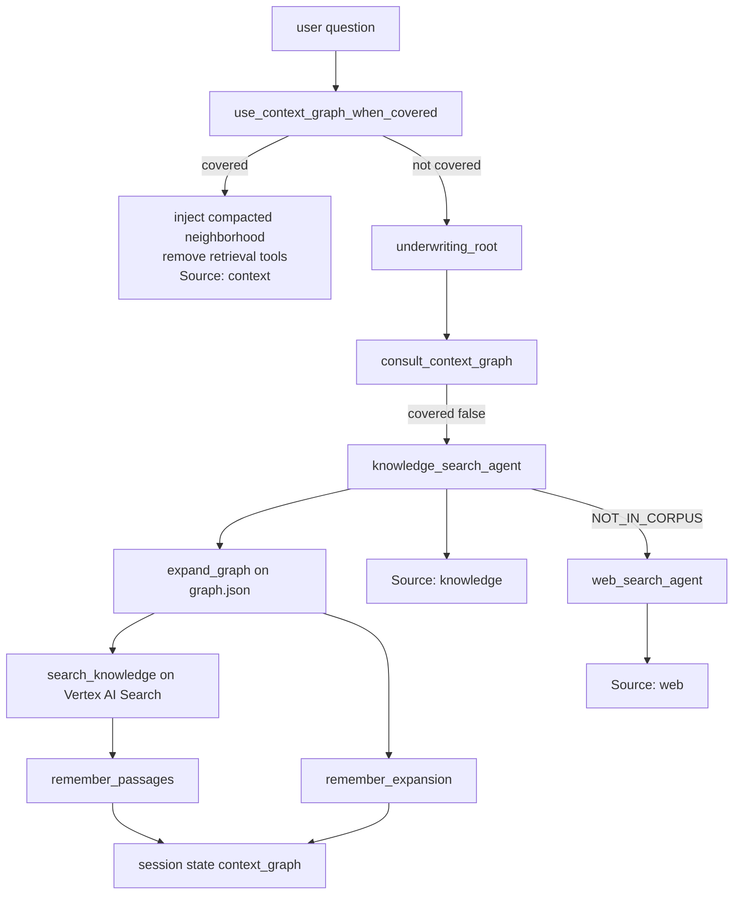

# Knowledge graph retrieval and the session context graph

Developer notes for the underwriting desk. The knowledge graph retrieves a new account or site from the book. The context graph is the neighborhood already retrieved in this chat. A later question that is still inside that neighborhood is answered from the session, without another ontology walk or Vertex AI Search call.

All underwriting figures are fictional.

## The two graphs

| | Knowledge graph | Context graph |
|---|---|---|
| Role | Retrieval index | Working set for this chat |
| Where it lives | `uw_chat/graph.json` plus three Vertex AI Search datastores | Agent Engine session state, key `context_graph` |
| Lifetime | Rebuilt by `scripts/provision_search.py` | One `session_id` |
| What a node holds | Id, label, title, datastore, article id, markdown excerpt | Id, label, title, datastore, article id, compacted `facts`, `focus` |
| Who reads it | `knowledge_search_agent` via `expand_graph` and `search_knowledge` | Root agent, before the model call, via `use_context_graph_when_covered` |



## Files

| File | What it does |
|---|---|
| `ontology/underwriting.md` | Entity types and the four relations |
| `uw_chat/graph.json` | 28 nodes, 52 edges. Shipped inside the agent |
| `uw_chat/graph_tool.py` | `seeds_for`, `expand_graph`. Writes the context graph |
| `uw_chat/search_tool.py` | `search_knowledge`. Folds matching chunks into facts |
| `uw_chat/context_graph.py` | Store, compact, dedupe, prune, cache, and the fast path |
| `uw_chat/agent.py` | Root, knowledge, and web agents. Callbacks are on the root |
| `uw_chat/gcp_config.py` | Project, datastore ids, serving-config paths |
| `backend/main.py` | Maps the `Source:` line to the badge the UI shows |
| `frontend/src/main.ts` | Badge type includes `context` |

The agents are ADK 2.8 `LlmAgent`s. `mode` is unset. The knowledge and web agents are `AgentTool`s, not `google.adk.workflow.Workflow` edges. Model is `gemini-2.5-flash` for all three.

## Ontology

| Type | Datastore id | Id pattern | Count |
|---|---|---|---|
| Account | `uw-accounts` | `companies/*` | 4 |
| Guideline | `uw-guidelines` | `ike/*` | 11 |
| Location | `uw-exposures` | `exposure/*` except `accum*` | 11 |
| Accumulation | `uw-exposures` | `exposure/accum*` | 2 |

| Relation | From | To |
|---|---|---|
| `HAS_LOCATION` | Account | Location |
| `GOVERNED_BY` | Account or Location | Guideline |
| `COUNTS_TOWARD` | Account or Location | Accumulation |
| `CAPPED_BY` | Accumulation | Guideline |

Syntheses in `okf/syntheses/` are left out of `graph.json`. The join is rebuilt at question time. Account attributes such as SIC are not nodes. They stay inside the page text and become facts only when a sentence in that page matches the compaction rules below.

Discovery Engine is `global`, collection `default_collection`, project `gcpexplore-487204`. The engine id is `uw-search`. Each store is queried on its own serving config:

`projects/gcpexplore-487204/locations/global/collections/default_collection/dataStores/{store}/servingConfigs/default_config`

## How a knowledge-graph retrieval runs

This path runs when the context graph does not cover the question. The root calls `knowledge_search_agent`. That agent must call `expand_graph` with the user question, then `search_knowledge` once per datastore that owns a returned node. The query for search is the node title. It also searches the datastore that matches the question when `expand_graph` missed it.

### 1. Seed the nodes named in the question

`seeds_for` in `uw_chat/graph_tool.py`.

Tokens are `[a-z0-9]{4,}` after lowercasing and stripping accents. Generic words are ignored (`warehouse`, `flood`, `county`, `that`, `breach`, and the rest of `_GENERIC`). Account tokens are `axium`, `baxter`, `goya`, `texwin`, `acquisitions`.

A token counts as mentioned when it occurs as a substring of the question and it also occurs in some node title. Place tokens are the mentioned tokens that are not account tokens.

A node is a seed when:

- An Account shares an account token with the question. `texwin` matches Texwin Acquisitions. `foods` and `international` do not, because they are generic.
- A Location, Guideline, or Accumulation shares a place token when the question has any place token. A Houston question does not also seed every other Texwin warehouse. `houston` is the place token; `texwin` is an account token and does not seed sibling sites.
- A guideline whose `article_id` appears in the question (`ike-uw-310`) is a seed even without a title token.
- If the question has no place token, a non-account node can still be a seed from its distinctive title tokens.

`Does that breach the cap?` has no distinctive token (`cap` is only three characters, and `breach` is generic). `seeds_for` returns an empty list.

### 2. Walk the ontology

`expand_graph` keeps the seeds, then adds a limited reverse hop, then two forward hops.

Reverse, one step, and only from a seed:

| Seed label | Reverse edge kept |
|---|---|
| Location | `HAS_LOCATION` into the account that owns it |
| Guideline | Source of a `GOVERNED_BY` or `CAPPED_BY` edge whose target is that guideline |
| Accumulation | `COUNTS_TOWARD` into the locations and accounts that feed it |

Forward, two hops, via `_forward`:

- Follow edges whose source is already kept.
- If any seed is a Location, `HAS_LOCATION` edges to other locations are dropped. Naming Houston does not pull Dallas.
- Other relations (`GOVERNED_BY`, `COUNTS_TOWARD`, `CAPPED_BY`) still walk forward, so the Houston location reaches its guidelines and the Harris County accumulation.

Edges kept are those whose source and target are both in the kept set. The tool returns at most 14 nodes (`ordered[:14]`), each with `id`, `label`, `title`, `datastore`, `article_id`, and `excerpt`. If nothing matches, the tool returns the four account titles and tells the agent to search `uw-accounts` by insured name.

`expand_graph` then calls `remember_expansion` when ADK injects `tool_context`. The returned excerpts are for the knowledge agent on this turn. The session stores compacted facts, not the raw excerpt.

### 3. Search the datastore that owns each node

`search_knowledge(datastore, query)` in `uw_chat/search_tool.py`.

`datastore` is `accounts`, `guidelines`, or `exposures`. The call is Discovery Engine `SearchServiceClient.search` with:

- `page_size` 5
- `SearchResultMode.CHUNKS`
- `num_previous_chunks` 0 and `num_next_chunks` 0

Each chunk is truncated to 1500 characters. On success the tool calls `remember_passages`. A chunk is attached only when the node is in the same datastore and the node title appears in the chunk text.

The knowledge agent answers from excerpts and passages. Passages win when they contain the fact. Excerpts are how it follows a relation the chunk did not repeat. If the fact is absent, the first line is exactly `NOT_IN_CORPUS`. The root then calls `web_search_agent`. `SEARCH_UNAVAILABLE` is used only when every search failed and the excerpts also lack the fact. The root does not call the web agent in that case.

## How the context graph is written

State key: `context_graph` on the root Agent Engine session.

`AgentTool` runs the knowledge agent in a fresh in-memory session. Parent state is copied in at the start. When `expand_graph` or `search_knowledge` sets `tool_context.state["context_graph"]`, that shows up as `event.actions.state_delta`. ADK copies that delta back onto the parent tool context (`google.adk.tools.agent_tool`), and the runner commits it on the root session. The next user turn on the same `session_id` sees it. The UI keeps that id in `localStorage` and sends it on `POST /api/chat`.

### `remember_expansion`

Called at the end of every `expand_graph` that has a tool context.

1. Load `context_graph`, or start from `{nodes: {}, edges: []}`.
2. Bump `revision` and drop `cache`. The next read must rebuild the prompt view.
3. For each returned node, replace the stored node with compacted facts. Previous facts and any leftover passages on that id are folded in, then deduped. The node `focus` is this revision. `focus_ids` becomes exactly the ids in this expansion. That list is what an unscoped follow-up means by "that".
4. Append edges whose `(source, relation, target)` is not already stored.
5. If there are more than 20 nodes, drop the lowest `focus` among nodes that are not in `focus_ids`. Edges and `focus_ids` are cut to the nodes that remain.
6. Assign `tool_context.state["context_graph"]` so ADK records the delta.

Stored node shape:

```json
{
  "id": "exposure/texwin-houston-whse",
  "label": "Location",
  "title": "Texwin Houston warehouse",
  "datastore": "exposures",
  "article_id": "",
  "facts": ["TIV: $38M", "Flood: Zone AE"],
  "focus": 1
}
```

The raw excerpt and the raw passage text are not kept on the session node.

### `remember_passages`

Called after a successful `search_knowledge`.

For each stored node in that datastore, if the node title occurs in a chunk, compact the chunk and merge those lines into `facts`. The revision bumps only when the fact list actually changes, which also clears the cache. `focus_ids` stays on the expansion that just ran, so a passage update does not move "that" onto a subset of the neighborhood.

## How the context graph is loaded and used

The fast path is `use_context_graph_when_covered`, the root's `before_model_callback`. It runs before the model chooses tools.

1. Read the latest user text. If this model call is already after a tool response, stop. A retrieval turn must still be allowed to finish as `Source: knowledge`.
2. Read `context_graph` from `callback_context.state`. If it has no nodes, stop.
3. Call `coverage_for`.
4. When `covered` is true and the prepared view has nodes, write the state back (so a new cache entry is committed), append the neighborhood to the system instruction, and remove `consult_context_graph`, `knowledge_search_agent`, and `web_search_agent` from the request.
5. Set `temp:context_fast_path`. The `temp:` prefix lasts for this invocation only.

`label_context_answer` is the root's `after_model_callback`. When the fast-path flag is set and the final (non-partial) response is text, it rewrites a missing or wrong source line to `Source: context`. The model often copies `Source: knowledge` from the previous turn. The callback is what the API and the badge trust.

`consult_context_graph` is still a root tool for turns that are not covered. It runs the same `coverage_for`. When the callback already took the fast path, that tool is not on the request.

### When a question is covered

`coverage_for` uses the same `seeds_for` as retrieval.

| Situation | Covered | What is shown |
|---|---|---|
| Every seed id is already in `nodes` | yes | Those seeds plus every stored node reachable by walking edges in either direction |
| The question names no seed, and `nodes` is not empty | yes | `focus_ids` only. Older accounts stay stored and are not shown |
| Some seed id is missing | no | Empty node list. The root must call `knowledge_search_agent` |
| The graph is empty | no | Empty node list |

A Houston question is covered on a later turn only when every seed is stored, including the account. `texwin` seeds Texwin Acquisitions as well as the Houston location. If the account node was never stored, the question is not covered and retrieval runs again.

`Does that breach the cap?` has no seeds. It is covered whenever the graph is non-empty, and the view is the latest `focus_ids`. After a Baxter retrieval, that follow-up is the Puerto Rico neighborhood, not Houston plus Baxter.

### Preparing the view, and the cache

`_prepare` selects the neighborhood, then either reuses or builds the prompt payload.

Cache key: `[revision, sorted node ids in the view]`.

On a hit, the stored `cache.nodes` and `cache.edges` are returned and `cached` is true. On a miss, each node is reduced to `id`, `label`, `title`, `article_id`, and `facts`, the cache is written, and `cached` is false. Any `remember_*` call increments `revision` and deletes `cache`, so a new retrieval cannot reuse the previous prompt.

There is one cache entry. A Houston follow-up and a later Baxter follow-up have different node-id sets, so each miss replaces the entry. Asking the same follow-up again, with no new retrieval, hits the cache.

The prompt lists each node, up to 8 facts, and edges rendered with titles (`Texwin Houston warehouse COUNTS_TOWARD Harris County accumulation`). It tells the model to use only those facts, and to begin with `Source: context`.

## Compaction, deduplication, pruning, caching

These four steps are what the model sees. They run inside `remember_expansion`, `remember_passages`, and `_prepare`.

### Compaction

`_compact_text` turns a markdown excerpt or a search chunk into short lines.

- Markdown links become their label. `**` and backticks are removed.
- Headings and `|---|` rules are dropped.
- A table row `TIV | $38M` becomes `TIV: $38M`. The `Field | Value` header is dropped.
- A prose line is split on sentence boundaries. A sentence is kept when it matches `_FACT`: a dollar amount, a percent, an `IKE-UW-` id, or one of `referral`, `decline`, `required`, `cap`, `zone`, `tiv`, `flood`, `bind`, `appetite`, `headroom`, `breach`, `elevation`.

Link-only lines such as "see the company page" do not become facts. The edge list carries those relations.

### Deduplication

`_dedupe_facts` runs per node, in the order facts were produced. Excerpt lines come before search-chunk lines, so the table row wins over a later chunk that repeats it.

A candidate is dropped when:

- Its normalized text equals an earlier fact, or is contained in one.
- Its signals are a subset of signals already kept. Signals are `$` amounts, percents, `IKE-UW-` ids, and the words `referral`, `decline`, `required`, `missing`, `breach`.

A chunk that says `Texwin Houston warehouse TIV: $38M. Flood: Zone AE.` does not add a second TIV line or a second flood line. At most 8 facts are kept on a node.

### Pruning

Two different cuts:

- **What this question sees.** No new entity: only `focus_ids`. Named entities: the seed closure inside the stored graph, not the whole session.
- **What the session keeps.** Cap is 20 nodes. Nodes outside the latest `focus_ids` go first, lowest `focus` first. Edges with a missing endpoint are removed.

Asking about Baxter does not delete Houston until the cap is hit. Naming Houston again is covered as long as those nodes are still stored.

### Caching

The cleaned neighborhood for one `(revision, node id set)` is stored at `context_graph.cache`. The fast path and `consult_context_graph` both go through `_prepare`, so they share that entry. The callback writes the state back after a covered read so the new cache is committed on the session.

## Session object

```json
{
  "revision": 2,
  "focus_ids": ["exposure/baxter-aibonito-pr", "exposure/accum-puerto-rico"],
  "nodes": {},
  "edges": [
    {"source": "companies/baxter-international", "relation": "HAS_LOCATION", "target": "exposure/baxter-aibonito-pr"}
  ],
  "cache": {
    "key": [2, ["exposure/accum-puerto-rico", "exposure/baxter-aibonito-pr"]],
    "nodes": [],
    "edges": []
  }
}
```

`nodes` is a map keyed by ontology id. `edges` is a list. `focus` on each node is the revision of the expansion that last wrote it.

To inspect a live session, call the reasoning engine `async_get_session` with the same `user_id` and `session_id` the API used. `POST /api/chat` creates the session with `async_create_session` on the first turn and streams every turn with `async_stream_query`.

## Source line and the UI

The root's first line is the contract.

| First line | `POST /api/chat` field `source` | Badge |
|---|---|---|
| `Source: context` | `context` | context |
| `Source: knowledge` | `knowledge` | knowledge |
| `Source: web` | `web` | web |
| `Source: knowledge+web` | `mixed` | mixed |

`backend/main.py` `_source` checks `context` before `knowledge`, because the word `knowledge` is not in the context line. The badge color is `--context` in `frontend/src/style.css`.

## Worked example

1. "What flood referral and accumulation cap apply to the Texwin Houston warehouse?"
   - Seeds include the Houston location and Texwin Acquisitions.
   - `expand_graph` adds the account by the reverse `HAS_LOCATION` hop, then the flood guideline and the Harris County accumulation by forward hops. Sibling Texwin warehouses are not added.
   - `search_knowledge` runs on `exposures`, `guidelines`, and `accounts`.
   - `remember_expansion` sets `focus_ids` to that neighborhood. Facts look like `TIV: $38M`, `Flood: Zone AE`, `In-force + bound TIV: $318M`, `IKE cap: $350M`.
   - Reply starts with `Source: knowledge`.

2. "Does that breach the cap?"
   - No seeds. The graph is non-empty, so it is covered.
   - The view is `focus_ids` from step 1. The prompt contains the `$318M + $38M = $356M` fact and the `$350M` cap.
   - Retrieval tools are removed. Reply starts with `Source: context`.

3. "What about the Baxter Aibonito plant?"
   - Baxter is not in the Houston neighborhood, so it is not covered.
   - Retrieval runs. `focus_ids` moves to the Baxter / Puerto Rico nodes. Houston nodes remain stored under older `focus` values.
   - Reply starts with `Source: knowledge`.

4. "Does that breach the cap?"
   - Again no seeds. The view is the new `focus_ids`. The prompt has the Puerto Rico `$22M`, `$45M`, and `$80M` facts, not the Harris County figures.
   - Reply starts with `Source: context`.

## Limits worth knowing

- `expand_graph` stores at most the 14 nodes it returns. A larger walk is truncated before `remember_expansion`.
- A passage is merged only when the full node title string occurs in the chunk.
- Compaction drops sentences that do not match `_FACT`. A qualitative sentence with none of those tokens never becomes a fact.
- The fast path removes web search for that turn as well as book search. A follow-up that also needs a public fact has to name something new, or be asked so that it is not covered.
- `temp:context_fast_path` is not part of `context_graph` and is not kept for the next user turn.
